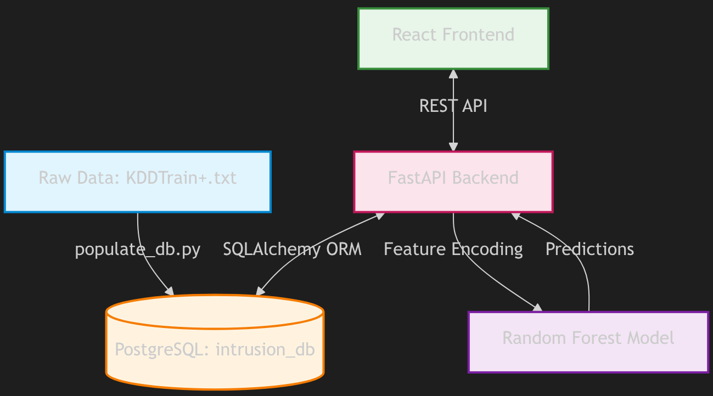

<div align="center">
  <h1>ML-Based Network Intrusion Detection System</h1>
  <p><strong>Classify and monitor network intrusions using Machine Learning, FastAPI, PostgreSQL, and a modern React dashboard.</strong></p>
  <p>
    
    
    
    
    
  </p>
</div>

---

## Overview

**DBMS Mini Project (21CSC205P) - SRMIST**  
**Team**: Aayushmaan Chakraborty & Shashank Prasad

This project implements a scalable **machine learning-based network intrusion detection system** on the **NSL-KDD dataset** with a normalized **PostgreSQL** backend, production-style **FastAPI** service layer, and a full-featured security operations frontend.

It classifies traffic as **`Normal`** or **`Intrusion`**, surfaces operational insights in real time, and supports analyst actions, telemetry, and geospatial monitoring workflows.

## System Architecture  


## Repository Architecture

```text
NetworkIntrusionDetection/
|-- ML-Based-Network-Intrusion-Detection-System/
|   |-- Intrusion_Detection.ipynb        # Model training and evaluation notebook
|   |-- intrusion_model.pkl              # Trained model artifact
|   `-- classification_report.txt        # Exported model metrics
|-- backend/
|   |-- routers/                         # FastAPI route modules
|   |-- services/                        # GeoIP and helper services
|   |-- main.py                          # API entrypoint
|   |-- models.py                        # SQLAlchemy ORM models
|   |-- schemas.py                       # Pydantic request/response schemas
|   `-- requirements.txt                 # Backend dependencies
|-- frontend/
|   |-- src/
|   |   |-- api/                         # API client + endpoint adapters
|   |   |-- components/                  # Layout, charts, UI blocks
|   |   |-- pages/                       # Auth, Dashboard, Connections, Predict, etc.
|   |   |-- hooks/                       # React Query data hooks
|   |   `-- store/                       # Zustand app/auth stores
|   |-- package.json
|   `-- vite.config.ts
|-- schema.sql                           # PostgreSQL schema
|-- populate_db.py                       # NSL-KDD ingestion script
`-- requirements.txt                     # Core ML/data dependencies
```

---

## Key Features

- ML inference endpoint (`/predict`) with class probabilities and confidence.
- PostgreSQL-backed telemetry for dashboard, analytics, and health monitoring.
- Real-time websocket feed (`/ws/live`) for live operational metrics.
- Connection exploration with filtering, detail drill-down, and analyst actions (`block`, `quarantine`, `ignore`).
- Geo pipeline with endpoint mapping + enrichment (`bootstrap-endpoints`, `enrich-geo`, `geo-status`, `geo-summary`).
- Modern SOC-style frontend with login flow, notifications, maps, and responsive pages.

## Technology Stack

| Layer | Stack |
| --- | --- |
| Frontend | React, TypeScript, Vite, Tailwind CSS, Zustand, React Query, Leaflet |
| Backend | FastAPI, Uvicorn, SQLAlchemy, Pydantic |
| Database | PostgreSQL |
| ML/Data | scikit-learn, pandas, numpy |

---

## Quick Start

### 1. Clone and open

```bash
git clone https://github.com/Aayushmaan-24/NetworkIntrusionDetection.git
cd NetworkIntrusionDetection
```

### 2. Setup PostgreSQL

Create database:

```sql
CREATE DATABASE intrusion_db;
```

Load schema:

```bash
psql -d intrusion_db -f schema.sql
```

### 3. Setup Backend Environment

We provide a convenient setup script that creates a virtual environment and installs all dependencies:

```bash
bash backend/setup.sh
```

*(Alternatively, you can manually create a venv and run `pip install -r backend/requirements.txt`)*

### 4. (Optional) Populate baseline dataset

Only required for fresh/empty databases. Ensure you have the ML dependencies installed (`pip install -r requirements.txt` at the root) and then run:

```bash
python populate_db.py
```

### 5. Run Backend

Use the provided run script to automatically activate the environment and start the FastAPI server:

```bash
cd backend
bash run.sh
```

Backend docs:
- Swagger: `http://localhost:8000/docs`
- ReDoc: `http://localhost:8000/redoc`

### 6. Run Frontend

In a separate terminal, install the Node dependencies and start the Vite dev server:

```bash
cd frontend
npm install
npm run dev
```

Frontend app:
- `http://localhost:5173`

---

## Configuration

### Backend

Configure in `backend/.env` (or environment variables):

- `DATABASE_URL` (PostgreSQL SQLAlchemy URL)
- `MODEL_PATH` (path to trained `.pkl` model)
- `HOST` / `PORT`

### Frontend

Optional environment:

- `VITE_API_BASE_URL` (default: `http://localhost:8000`)

You can also change API URL at runtime from **Settings -> Backend Base URL**.

---

## API Snapshot

### Core

- `GET /health` - API + DB + model status
- `GET /dashboard` - dashboard aggregate stats
- `POST /predict` - intrusion prediction
- `GET /predict/history` - prediction logs

### Connections and Operations

- `GET /connections` - paginated connections list
- `GET /connections/{connection_id}` - single connection detail
- `POST /connections/{connection_id}/action` - persist operator action
- `GET /connections/{connection_id}/actions` - action history

### Geo and Realtime

- `POST /connections/bootstrap-endpoints` - map endpoint IPs
- `POST /connections/enrich-geo` - GeoIP enrichment
- `GET /connections/geo-status` - coverage + precision stats
- `GET /connections/geo-summary` - city-level geo analytics
- `GET /ws/live` - websocket telemetry stream

---

## Prediction Testing (Sample Payload)

```json
{
  "duration": 12,
  "protocol_type": "tcp",
  "service": "http",
  "flag": "SF",
  "src_bytes": 320,
  "dst_bytes": 14500,
  "land": 0,
  "logged_in": 1,
  "count": 2,
  "srv_count": 2,
  "serror_rate": 0.0,
  "rerror_rate": 0.0,
  "same_srv_rate": 1.0,
  "dst_host_count": 35,
  "dst_host_srv_count": 30,
  "dst_host_same_srv_rate": 0.86,
  "dst_host_diff_srv_rate": 0.08,
  "dst_host_serror_rate": 0.0
}
```

---

## Operational Notes

- You do **not** need to run `populate_db.py` on every backend restart.
- Re-run `populate_db.py` only for fresh DB initialization or intentional reset.
- Geo coverage starts low by design and increases as endpoint mappings + enrichment accumulate.

---

## Troubleshooting

- `ModuleNotFoundError` (e.g., `fastapi`, `tqdm`): activate `.venv` and install dependencies.
- `timeout exceeded` on import/sync: retry with backend running; operations are batched for responsiveness.
- `geo-status` showing low percentage: expected when total connection count is very large.
- Frontend stale values: click `Refresh Telemetry` or hard refresh (`Ctrl + F5`).

---

## Project Workflow (Team Collaboration)

- Work on feature branches (example: `NIDS-COMPLETE`).
- Open PR into `main` for review and merge.
- Avoid direct pushes to `main` during parallel development.

---

## Results Summary

- Strong baseline binary classification for `Normal` vs `Intrusion`.
- Real-time telemetry and actionable SOC-like operational UI.
- End-to-end integration across ML, backend APIs, database persistence, and frontend workflows.

---

## License and References

Distributed under the **MIT License**.

- NSL-KDD: [University of New Brunswick CIC](https://www.unb.ca/cic/datasets/nsl.html)
- Kaggle Mirror: [NSL-KDD Dataset](https://www.kaggle.com/datasets/hassan06/nslkdd)
